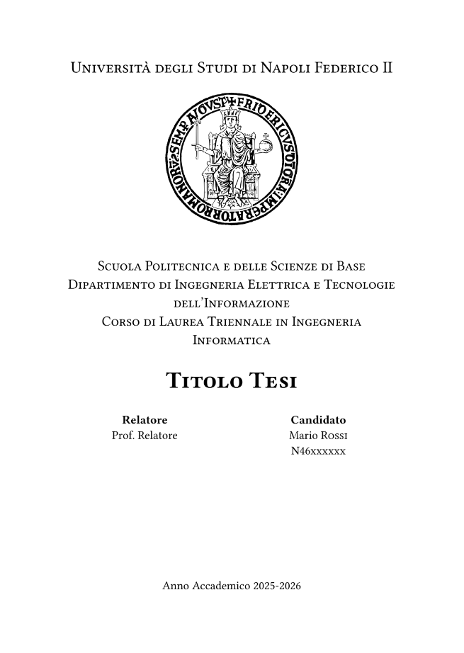

# typst-unina
Template per una tesi di laurea in typst per l'università Federico II.

## Preview frontespizio

*Riferirsi al file `target/main.pdf` per vedere il risultato completo*

## Struttura
. \
├── .github \
│   └── frontespizio.png \
├── content \
│   ├── images \
│   │      └── logo_unina.png \
│   ├── sections \
│   │     ├── abstract.typ \
│   │     ├── chapter1.typ \
│   │     ├── dedication.typ \
│   │     ├── front_page.typ \
│   │     ├── introduction.typ \
│   │     └── table_of_contents.typ \
│   ├── config.typ \
│   └── bibliography.yml \
├── target \
│      └── main.pdf \
├── main.typ \
└── README.md

- ### `main.typ`
File principale, include tutti gli altri capitoli (unico file da compilare).
- ### `content/config.typ`
Contiene le variabili di configurazione globale e le impostazioni di formattazione
> **_NOTA_** è possibile utilizzare le variabili qui definite importando il file con `#import "content/config.typ": *`.
Per utilizzare le impostazioni di formattazione non è invece necessario importare il file dal momento che se ne occupa il main.
- ### `target/`
Directory di destinazione per il compilatore
> **_NOTA:_** è possibile compilare manualmente con `typst compile main.typ target/main.pdf`, altrimenti per sfruttare le funzionalità dell'editor di _compile on save_, scegliere `target` come cartella di destinazione dalle impostazioni dell'editor. \
Se invece si sta usando l'editor online non è possibile (che io sappia) compilare in `target/` perché si può solo esportare e scaricare il pdf.

# Uso
### Locale
1. Scaricare [typst](https://typst.app/open-source/#download) (e aggiungere al `PATH` se richiesto)
2. Clonare questa repo, eventualmente rimuovendo i file inutili (**README.md**, **.github** ecc.)
3. Modificare `main.typ` per aggiungere o rimuovere sezioni nel documento
4. Modificare i file in `content/sections` per cambiare il contenuto del documento
5. Modificare `config.typ` per cambiare le impostazioni di formattazione globali o aggiungere/rimuovere variabili globali
6. Modificare la bibliografia nel file `bibliography.yml` utilizzando il formato [Hayagriva](https://github.com/typst/hayagriva/blob/main/docs/file-format.md) 
> **_NOTA_** *typst* supporta anche il formato *BibLaTeX* (estensione `.bib`)
7. Compilare con `typst compile main.typ target/main.pdf`

### Editor online
*TODO*
